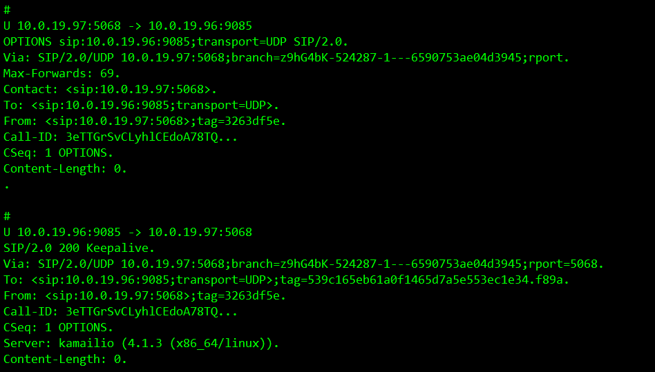

##  一、ngrep命令简介
ngrep命令是grep命令的网络版，他力求更多的grep特征，用于搜寻指定的数据包。正由于安装ngrep需用到libpcap库，所以支持大量的操作系统和网络协议。能识别TCP、UDP和ICMP包，理解bpf的过滤机制。

## 二、安装
ngrep命令的下载地址：http://ngrep.sourceforge.net/，libpcap下载地址：http://www.tcpdump.org/。
先用yum install libpcap完全安装libpcap，然后使用yum install ngrep 安装ngrep，再注意有时候用libpcap安装包安装的不完整会影响ngrep的使用。

在CentOS 6.5 系统下 我们直接使用yum进行安装：

    # yum install ngrep

## 三、语法

    ngrep <-hNXViwqpevxlDtTRM> <-IO pcap_dump> <-n num> <-d dev> <-A num>
          <-s snaplen> <-S limitlen> <-W normal|byline|single|none> <-c cols>
          <-P char> <-F file> <match expression> <bpf filter>

## 四、选项

    -h  is help/usage
    -V  is version information
    -q  is be quiet (don't print packet reception hash marks)
    -e  is show empty packets    显示空数据包
    -i  is ignore case    忽略大小写
    -v  is invert matched    反转匹配
    -R  is don't do privilege revocation logic
    -x  is print in alternate hexdump format    以16进制格式显示
    -X  is interpret match expression as hexadecimal    以16进制格式匹配
    -w  is word-regex (expression must match as a word)    整字匹配
    -p  is don't go into promiscuous mode    不使用混杂模式
    -l  is make stdout line buffered
    -D  is replay pcap_dumps with their recorded time intervals
    -t  is print timestamp every time a packet is matched    在每个匹配的包之前显示时间戳
    -T  is print delta timestamp every time a packet is matched
         specify twice for delta from first match    显示上一个匹配的数据包之间的时间间隔
    -M  is don't do multi-line match (do single-line match instead)    仅进行单行匹配
    -I  is read packet stream from pcap format file pcap_dump   从文件中读取数据进行匹配
    -O  is dump matched packets in pcap format to pcap_dump    将匹配的数据保存到文件
    -n  is look at only num packets   仅捕获指定数目的数据包进行查看
    -A  is dump num packets after a match    匹配到数据包后dump随后的指定数目的数据包
    -s  is set the bpf caplen
    -S  is set the limitlen on matched packets
    -W  is set the dump format (normal, byline, single, none)    设置显示格式byline，将解析包中的换行符
    -c  is force the column width to the specified size    强制显示列的宽度
    -P  is set the non-printable display char to what is specified
    -F  is read the bpf filter from the specified file    使用文件中定义的bpf(Berkeley Packet Filter)
    -N  is show sub protocol number    显示由IANA定义的子协议号
    -d  is use specified device instead of the pcap default    使用哪个网卡，可以用-L选项查询

## 五、常用范例：

#### 1、监听本地eth0网卡 [-d eth0]，监听9085端口 [port 5068]：
-W byline 用来解析包中的换行符，否则包里的所有数据都是连续的

    # ngrep -d eth0 port 5068 -W byline

#### 2、监听指定ip发来的数据包 [host 10.0.19.96 or host 10.0.19.104]:

    # ngrep -d eth0  host 10.0.19.96 or host 10.0.19.104 and port 5068 -W byline